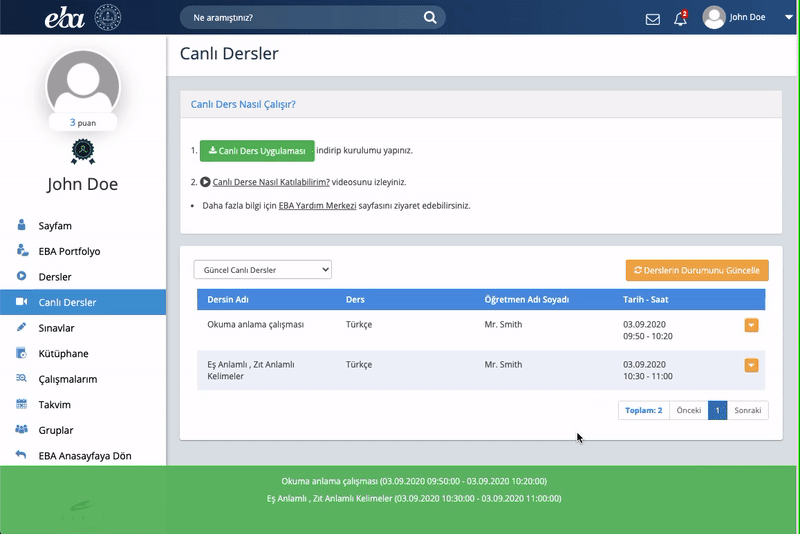

# EBA~Zoom Link

## Nedir?

EBA~Zoom Link, Linux ve macOS (ve pek tabii Windows!) sistemlerde EBA uygulamasına gerek duymadan canlı derslere katılmayı mümkün kılan bir [Kullanıcı Betiği](http://www.operaturkiye.net/kullanici-java-betigi-userjs-nedir/index.html)dir.

## Kullanım Talimatları

1. Bilgisayarınıza [Zoom](https://zoom.us/download) uygulamasını kurun.

2. Tarayıcınız için tasarlanmış [Tampermonkey](https://www.tampermonkey.net/) eklentisini kurun. (Kullanıcı betiği çalıştırmak için gerekli.)

3. [EBA~Zoom Link](EBA_Zoom_Link.user.js?raw=true) betiğine ulaşın. Kullanıcı betiği kurulumu ekranında `Yükle`yi seçin.

4. [EBA](https://ders.eba.gov.tr/) portalında oturum açın (oturumunuz açıksa sayfayı yenileyin).

5. Hepsi bu!

   Aktif canlı dersleriniz sayfanın alt bölümünde listelenecektir. İlgili derse tıklayarak Zoom uygulaması üzerinden derse katılabilirsiniz. 🎓

### Notlar

1. Yukarıdaki adımları sadece bir defa uygulamanız yeterlidir.

2. Dilediğiniz zaman Tampermonkey eklenti seçeneklerinden betiği devredışı bırakabilirsiniz.

3. Herhangi bir sorunla karşılaşmanız durumunda önce tarayıcınızı güncellemeyi deneyin. Sorun devam ederse `issue` açmaktan çekinmeyin. 😊

4. [eba-canli-ders.js](https://gist.github.com/sh4dowb/9ecdc521c7323411f3294d5126a2bfde) betiğinden esinlenilmiştir. @sh4dowb 👌

### Örnek ekran görüntüsü

